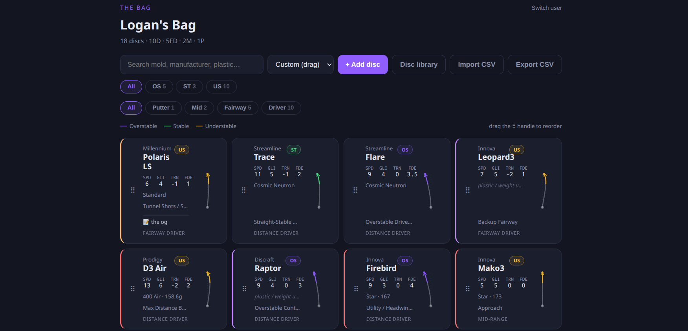

<p align="center">
  
</p>

<h1 align="center">Disc Tracker</h1>

<p align="center">
  A personal disc golf bag tracker. Log your discs, visualize flight paths, and keep your bag organized — running on your own server.
</p>

---



---

## Features

- **Multi-user** — profile picker on launch, no passwords, each user has their own bag
- **Disc library** — search 1,660+ discs by name or manufacturer, auto-fill flight numbers
- **Flight path arcs** — top-down visualization per disc shaped by speed / glide / turn / fade, two-phase bezier (turn + fade), colored by stability
- **Flight Shape tool** — interactive page at `/flightshape`: adjust hyzer, nose pitch, wind, arm power, and spin to see how conditions warp a disc's arc in real time; includes estimated distance output
- **Disc Suggest tool** — recommends discs from your bag based on shot shape needed
- **Stability & type filters** — filter by overstable / stable / understable and disc type
- **Disc colors** — assign a color per disc with presets or a custom color picker
- **Drag reorder** — manually sort your bag in custom mode
- **CSV import / export** — back up or move your collection

---

## Stability Colors

| Stability | Color |
|-----------|-------|
| Overstable | Purple |
| Stable | Green |
| Understable | Yellow/Gold |

---

## Flight Shape Tool (`/flightshape`)

Adjust five throw conditions and watch the arc update live:

| Slider | Range | Effect |
|--------|-------|--------|
| Hyzer | ±30° | Positive = hyzer angle, increases fade |
| Nose | ±15° | Nose up = higher AOA, more understable |
| Wind | ±20 mph | Headwind = more overstable; tailwind = more understable |
| Arm | 50–100% | Under-power shifts fast discs understable |
| Spin | 50–100% | Lower spin = reduced gyroscopic stability, more turn |

Physics grounded in Kamaruddin, Potts & Crowther (2018) — *Aerodynamic Performance of Flying Discs*.

---

## Requirements

- Python 3.9+
- Flask

---

## Setup

**1. Clone the repo**

```bash
git clone https://github.com/flyboy-byte/disc-tracker.git
cd disc-tracker
```

**2. Install dependencies**

```bash
pip install flask
```

**3. Run**

```bash
python app.py
```

Opens on `http://localhost:5757`. The SQLite database and secret key are created automatically in `data/` on first launch.

---

## Running as a service (Linux / systemd)

A unit file is included. Edit `disc_tracker.service` to match your paths, then:

```bash
cp disc_tracker.service ~/.config/systemd/user/
systemctl --user daemon-reload
systemctl --user enable disc_tracker
systemctl --user start disc_tracker
```

---

## Data

User data lives in `data/` and is excluded from version control. Nothing leaves your server.

---

## License

MIT
