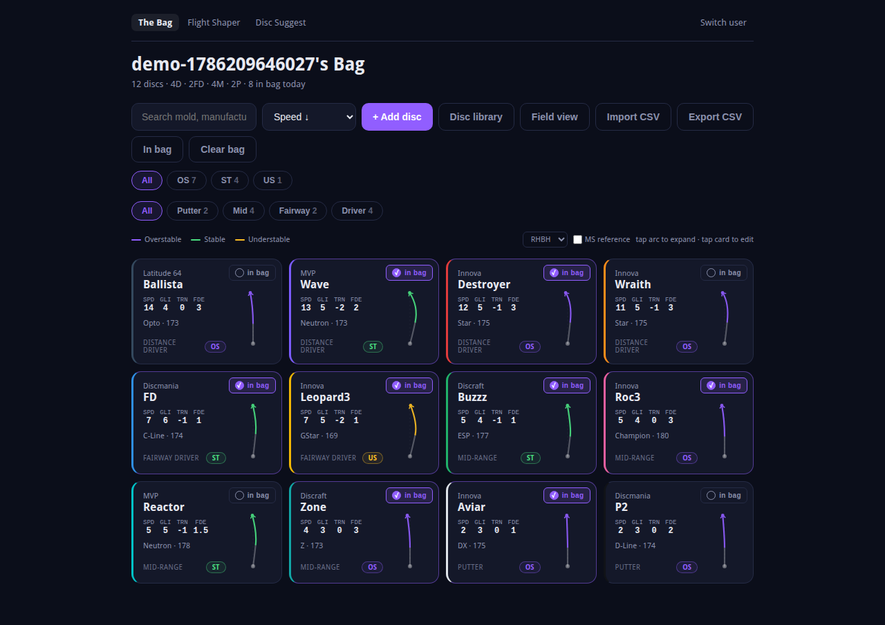
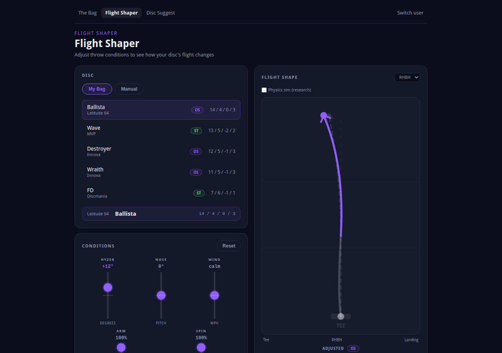
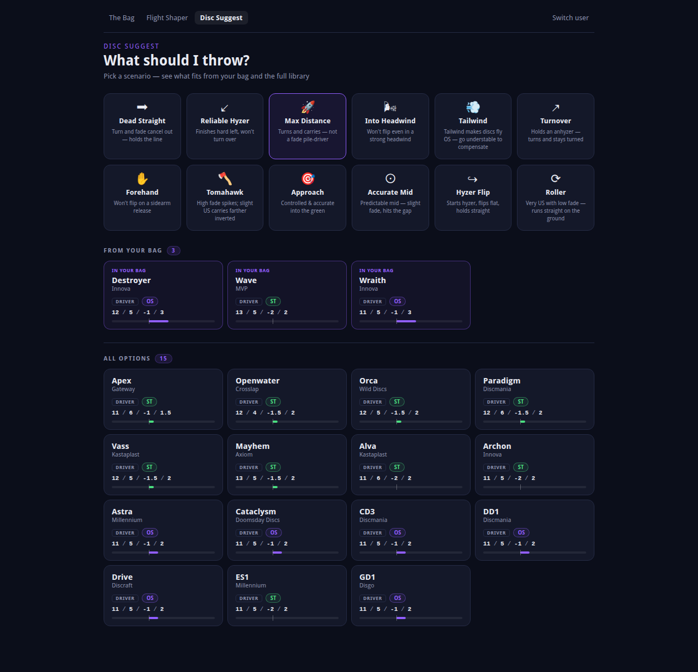
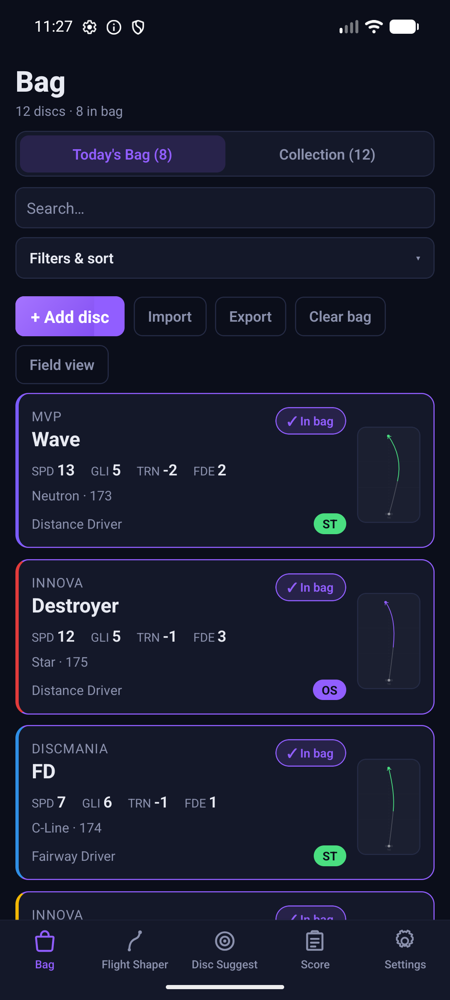
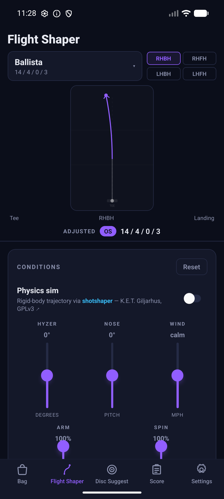
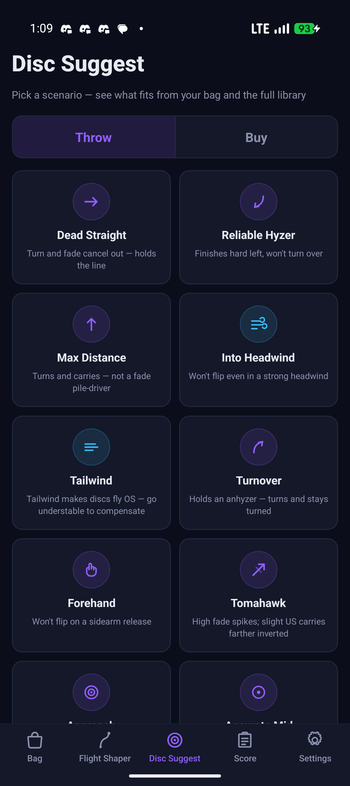
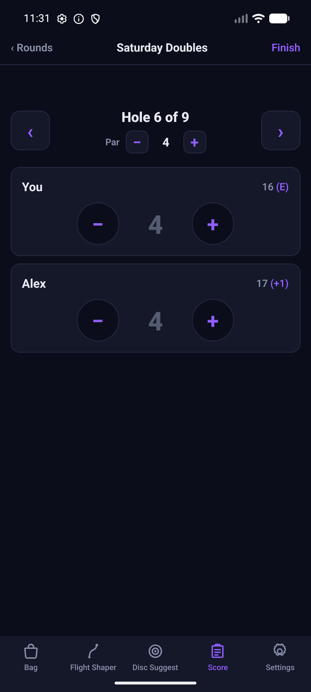
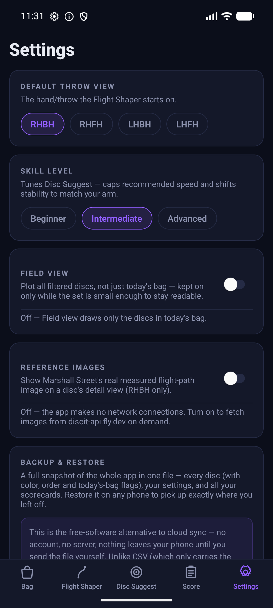

<p align="center">
  
</p>

<h1 align="center">Disc Tracker</h1>

<p align="center">
  A disc golf bag tracker that belongs to <em>you</em> — your discs, your data, on your own device.<br>
  No accounts. No cloud. No tracking. No ads.
</p>

---

Disc Tracker is two things that share one brain:

- **A self-hosted web app** — the original, running on a small personal VPS. It's the canonical
  version and the spec everything else follows.
- **A local-first Android app** — a full port that keeps everything on your phone in an on-device
  database. It never talks to a server to work.

Both share the same 1,660-disc library, the same flight-arc math, and the same core idea: a fast,
private place to manage your bag, understand how your discs fly, and figure out what to throw.
The mobile app also offers an optional, larger catalog as an in-app download — [disc data by
Try Discs](https://api.trydiscs.com), used only for on-device lookup/suggest/audit, never
re-served or published as a standalone dataset. Try Discs lists 2,147 molds; the downloaded
catalog includes 1,874 of them — the other 273 are left out because they're missing complete
flight numbers (speed/glide/turn/fade), which this app requires so every disc works fully in
Flight Shaper and Disc Suggest.

---

## Privacy, by design

This is the whole point, so it goes first.

- **No accounts, no passwords, no sign-up.** You just use it.
- **No cloud.** The web app stores everything in a local SQLite file on the machine *you* run it
  on. The Android app stores everything in a SQLite database on *your phone*. There is no backend
  service collecting anything.
- **No analytics, no trackers, no ads, no telemetry.** None. There is no third-party SDK phoning
  home — no Firebase, no Sentry, no crash reporters, no "anonymous usage stats."
- **The Android app makes zero network connections** in its default configuration. You can watch
  it stay silent.
- **One optional, opt-in exception:** real measured flight-path reference images from the public
  [DiscIt API](https://discit-api.fly.dev). It's **off by default**; when off, no request is ever
  made. When on, it fetches a single image per disc on demand and caches it. That's the only
  outside service either surface will ever touch — and only if you ask it to.
- **Your data moves the way you move it.** Export to CSV, or use the app's full backup file, and
  carry it to a new phone yourself. Nothing leaves a device unless you send it.
- **Open source (GPLv3).** The code is here to read. The Android app is built to be
  [F-Droid](https://f-droid.org)-reproducible — no proprietary blobs, a pinned toolchain, and a
  clean dependency tree — so the binary can be verified against this source.

---

## How it all works

```
        ┌─────────────────────────────┐        ┌──────────────────────────────┐
        │        WEB APP (VPS)         │        │     ANDROID APP (on phone)    │
        │  Flask · SQLite · vanilla JS │        │  Expo / React Native · SQLite │
        │  the canonical version       │        │  local-first, no server dep   │
        └──────────────┬──────────────┘        └───────────────┬──────────────┘
                       │                                        │
                       └──────────────┬─────────────────────────┘
                                      │  shared foundation
                     ┌────────────────┴────────────────┐
                     │  • 1,660+ disc library (bundled) │
                     │  • flight-arc physics model      │
                     │  • disc-suggestion scoring       │
                     └──────────────────────────────────┘
```

**The web app** is deliberately boring in the best way: Flask, a single SQLite file, and
vanilla JavaScript with no build step. It supports multiple local profiles (a picker on launch —
still no passwords). It's the reference implementation; when the two disagree, the website wins.

**The Android app** is a faithful, standalone port. Every feature runs on-device against local
SQLite, including a from-scratch TypeScript reimplementation of the flight physics — so it works
in a field with no signal exactly as well as it does at home.

---

## The web app

<p align="center">
  
</p>

<table>
  <tr>
    <td width="50%"></td>
    <td width="50%"></td>
  </tr>
  <tr>
    <td align="center"><b>Flight Shaper</b> — shape the arc with sliders</td>
    <td align="center"><b>Disc Suggest</b> — ranked picks for a shot</td>
  </tr>
</table>

- **Bag management** — search 1,660+ discs, auto-fill flight numbers, assign colors, drag to
  reorder, filter by stability/type.
- **Flight-path arcs** — top-down visualization shaped by speed/glide/turn/fade, colored by
  stability.
- **Flight Shaper** — adjust hyzer, nose, wind, arm power, and spin; watch the arc and distance
  estimate update live. Optional physics-sim mode (below).
- **Disc Suggest** — recommends discs for 12 shot shapes, from your bag *and* the full library.
- **Today's bag** — check off what's in the bag today; export a filtered CSV.
- **Multi-user** — profile picker on launch, each profile its own bag.

## The Android app

Five tabs, all working offline. Confirmed on real hardware; preview APKs live on the
[**Releases page**](https://github.com/flyboy-byte/disc-tracker/releases) for sideloading, now
signed with the production release key. Play Store and F-Droid are the next step.

<table>
  <tr>
    <td></td>
    <td></td>
    <td></td>
    <td></td>
    <td></td>
  </tr>
  <tr>
    <td align="center"><b>Bag</b></td>
    <td align="center"><b>Flight Shaper</b></td>
    <td align="center"><b>Disc Suggest</b></td>
    <td align="center"><b>Score</b></td>
    <td align="center"><b>Settings</b></td>
  </tr>
</table>

- **Bag** — full CRUD from the disc library, per-disc flight-arc thumbnails, filters, colors, a
  Today's-Bag / Collection split that scales to big collections, and a **shareable bag report**
  (a clean image of your bag, straight to the Android share sheet).
- **Flight Shaper** — the slider tool with a live arc, plus an opt-in on-device physics sim.
- **Disc Suggest** — skill-aware recommendations (Beginner / Intermediate / Advanced) with
  great/good/marginal fit chips.
- **Score** — a dead-simple **offline scorekeeper** for when the scoring app won't load or there's
  no signal: hole-by-hole, 1–8 players, running totals vs. par, saved rounds. No account, no course
  lookup, no GPS.
- **Settings** — throw view, skill level, opt-in reference images, a **disc catalog picker**
  (switch between the built-in library, the larger Try Discs catalog, or your own imported
  catalog file/URL), and **full backup & restore** (one file: discs + today's bag + settings +
  scorecards — share it, or save it straight to a folder on your device; move to a new phone, no
  server).

---

## The flight model

The Flight Shaper turns throw conditions into stability shifts, then draws the arc:

| Slider | Range | Effect |
|--------|-------|--------|
| Hyzer | ±30° | Positive = hyzer angle, increases fade |
| Nose | ±15° | Nose up = higher AOA, more understable |
| Wind | ±20 mph | Headwind = more understable (flips more); tailwind = more overstable |
| Crosswind | ±20 mph | Physics-sim mode only — lateral wind |
| Arm | 50–100% | Under-power shifts fast discs understable |
| Spin | 50–100% | Lower spin = reduced gyroscopic stability, more turn |

Stability is the net of turn + fade:

| Label | Net (fade + turn) | Color |
|-------|-------------------|-------|
| OS (overstable) | ≥ 1 | Purple |
| ST (stable) | −1 to 1 exclusive | Green |
| US (understable) | ≤ −1 | Gold |

Physics based on Kamaruddin, Potts & Crowther (2018) — *Aerodynamic Performance of Flying Discs*.
There's also an opt-in **Physics sim** mode — a real rigid-body flight simulator
([shotshaper](https://github.com/kegiljarhus/shotshaper), GPLv3) — for driver-class discs.
Research/experimental, off by default; on the phone it runs entirely on-device.

---

## Running it yourself

Want the web app on your own machine? It's a plain Flask app — no build step, no database to
provision.

```bash
git clone https://github.com/flyboy-byte/disc-tracker.git
cd disc-tracker
python3 -m venv venv && source venv/bin/activate
pip install -r requirements.txt
python app.py            # → http://localhost:5757
```

The database and secret key are created for you in `data/` on first run. (`numpy`/`scipy`/`pyyaml`
are only needed for the optional Physics-sim mode; everything else is Flask alone.) A systemd unit
(`disc_tracker.service`) and a `deploy.sh` are included for running it as a service.

For the **Android app**, grab an APK from the
[Releases page](https://github.com/flyboy-byte/disc-tracker/releases) — no build required.

---

## License

GPLv3 — see [`LICENSE`](LICENSE).
