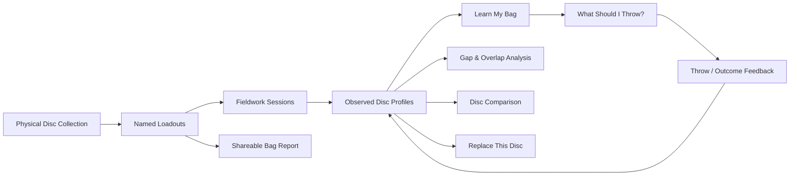
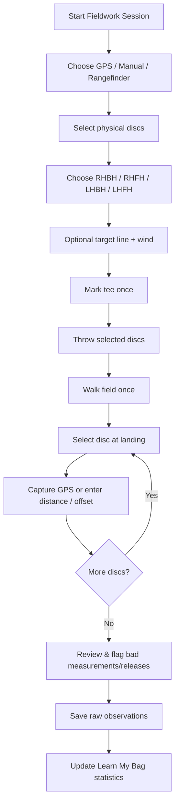
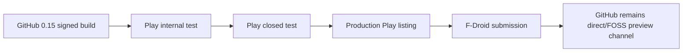

<!-- SOURCE-OF-RECORD — do not edit the body; it is the raw report kept verbatim. -->

# Strategy review — 2026-08-08 (raw, source-of-record)

> Commissioned by Logan as a deliberate **product-strategy review** (ChatGPT deep-research
> report), not a code review. Kept here verbatim as the source-of-record. The distilled thesis,
> decisions, sequencing, and the **C-series** roadmap items derived from it live in
> [`../docs/direction-2026-08-08.md`](../docs/direction-2026-08-08.md), which the Post-v1 Roadmap
> table in `../../PORT_PLAN.md` points at.
>
> Where this report and the current plan disagree — most notably its "**ship to Play/F-Droid
> now, before more features**" recommendation — the direction doc records Logan's actual call
> (2026-08-08): **features + future-proofing + audience planning first; the store track stays
> deliberately parked.** Read this report for the *reasoning*; read the direction doc for *what
> we're doing about it*.
>
> Some of the report's "immediate fixes" were already resolved before/at the time it was written
> (README headwind/tailwind wording, the `0.12`→`0.15` release-status drift, the over-absolute
> privacy blurb) — see the direction doc's "Already handled" note.

---

# Disc Tracker Product Research: Building a Recurring-Use Disc Intelligence App

## Executive summary

**Fact:** As of August 8, 2026, Disc Tracker is substantially more mature than its README implies. The Android app already has a local SQLite-backed collection, Today's Bag, 1,660+ catalog discs, Flight Shaper, an opt-in rigid-body physics simulator, skill-aware Disc Suggest, an offline scorekeeper, full-device JSON backup/restore, CSV interoperability, optional Marshall Street reference images, and a polished five-tab interface. The latest GitHub release is `mobile-preview-0.15`, released August 1, 2026, and is the first production-signed preview; the README still says `0.12`. citeturn17view0turn17view1turn18view2

**Inference:** The app's main product problem is no longer feature completeness. It is that most existing features are **utility islands**. A user can build a bag, look at flight arcs, try Disc Suggest, and back up the app, but little currently gets more valuable because the user came back tomorrow. UDisc gets recurring use from rounds, courses, statistics, and practice; DiscMate gets repeat value from bag management, multiple bags, analysis, and social discovery; TryDiscs captures repeated purchase/comparison intent; fieldwork-focused products turn practice itself into a data-collection loop. citeturn9search1turn22search0turn21search1turn21search9

The strongest strategic direction is therefore **not** “add more unrelated disc-golf tools.” It is to turn Disc Tracker into a **personal disc-intelligence system**:

> **Tell Disc Tracker what discs you physically own → measure how you actually throw them → let the app learn their real behavior for you → ask what to throw → record what happened → improve the recommendation.**

That loop differentiates Disc Tracker from a generic flight-number database and avoids attempting to displace UDisc's enormous course, scoring, events, and community infrastructure. UDisc currently presents itself around discovering courses, scoring rounds, tracking improvement and community, with a course network exceeding 17,000 courses; its current app also includes throw measurement and practice tools. citeturn9search1turn9search7turn21search9

The recommended product architecture is:



The highest-value additions are:

| Priority | Capability | Effort | Expected impact | Why |
|---|---|---:|---:|---|
| Immediate | Correct docs + ship Play closed testing | Low–Medium | High | The app is already good enough to reach ordinary Android users; sideload-only distribution is now a larger audience constraint than missing features. |
| Next | Named loadouts | Low–Medium | Medium–High | Fixes Today's Bag's one-dimensional model and becomes infrastructure for recommendations and reports. |
| Next | “What should I throw?” v1 | Medium | High | Turns existing Suggest + Flight Shaper + physics into an on-course decision tool. |
| Core investment | Fieldwork MVP | High | Very High | Creates the recurring data-collection loop and uniquely valuable proprietary-per-user data. |
| Core investment | Learn My Bag | High | Very High | Makes every future recommendation better because the user has used the app before. |
| After data exists | Personalized Throw Advisor v2 | High | Very High | Converts raw practice data into actual competitive advantage. |
| After data exists | Bag overlap/gap analyzer | Medium | High | Converts collection data into actionable bag decisions. |
| Parallel | Disc Compare + Replace This Disc | Medium | Medium–High | Strong collector/purchasing utility and natural use of the 1,660+ library. |
| Parallel | Shareable Bag Report | Low–Medium | High for acquisition | Gives the local-only app an organic distribution mechanism without building a social network. |
| Distribution | F-Droid | Medium | Medium | Excellent philosophical/privacy fit, but Play should remain the primary mainstream-discovery channel. |

The most important design principle is to **never pretend factory flight numbers and an individual's observed flight are the same thing**. Disc Tracker should preserve factory/catalog numbers, retain any user override separately, and add a third layer containing observed outcomes. Disc-golf trajectory research shows that actual flight depends on aerodynamic properties and throw parameters; trajectory models combine disc-specific aerodynamics with rigid-body dynamics rather than reducing flight to four numbers. citeturn23search2

Similarly, fieldwork GPS must be treated as uncertain measurement rather than ground truth. Android explicitly allows users to grant approximate rather than precise location, and even precise location is not guaranteed to be within a few meters; Android describes precise fixes as usually within roughly 50 meters but sometimes accurate to a few meters. citeturn22search1turn22search2turn22search3 For disc-golf fieldwork, Disc Tracker should show the reported uncertainty, reject poor fixes from calibration, provide manual/rangefinder entry, and preferably store **relative landing vectors rather than absolute latitude/longitude by default**.

The product positioning I would use is:

> **Disc Tracker learns your actual discs and helps you choose the right one. Offline, private, and based on how you throw—not just the numbers stamped on the disc.**

That is a much more defensible reason to keep using the app than “another bag tracker.”

## Current product and competitive position

**Current repository inventory.** The web application remains a Flask self-hosted bag tracker with multi-user profile selection, searchable disc data, flight-path visualizations, Flight Shape controls, Disc Suggest, Today's Bag, and CSV import/export. The server initializes its database locally, and only the optional physics simulator needs NumPy/SciPy/PyYAML according to the repository documentation. citeturn17view0

The Android application is now the strategically more interesting product. It is an Expo/React Native application using on-device SQLite rather than depending on the Flask server. The current repository describes five tabs: Bag, Flight Shaper, Disc Suggest, Score, and Settings. citeturn17view0turn19view2

| Surface | Current user flow | Existing value | Recurring-use limitation |
|---|---|---|---|
| **Web bag** | Pick profile → add/search discs → organize bag → view arcs → export CSV | Mature self-hosted collection manager with multi-user profiles. citeturn17view0 | Mostly setup/maintenance behavior rather than something that improves every time it is used. |
| **Mobile Bag** | Today's Bag or Collection → search/filter → add/edit/delete → change colors/order → inspect arcs/Field view | Full CRUD from 1,660+ library, per-disc arcs, large-collection pagination, targeted DB writes and Field view. citeturn18view2turn20view0 | Today's Bag is effectively one binary membership flag rather than a reusable loadout system. |
| **Flight Shaper** | Pick disc → choose BH/FH/hand → change hyzer/nose/wind/arm/spin → inspect path/distance | Existing interactive simulation infrastructure already suitable for powering recommendation explanations. citeturn17view0turn18view1 | It is exploratory rather than outcome-calibrated: the app does not learn from the user's real throws. |
| **Physics mode** | Opt in → use driver archetype → simulate rigid-body trajectory/crosswind | On-device TypeScript port of `shotshaper`; repository reports parity testing against the upstream simulator. citeturn18view2 | Current physics mode is explicitly limited by available driver archetypes and lacks putter/midrange aerodynamic data. citeturn18view2 |
| **Disc Suggest** | Pick one of 12 scenarios → score bag/library discs → show Great/Good/Marginal results | Unified scorer, skill presets and soft speed handling are a solid recommendation foundation. citeturn18view2turn20view1 | User first has to translate the real shot into one of 12 predefined scenarios; results know factory numbers and skill preset, not actual personal dispersion/distance. |
| **Score** | Start round → optional label/course → select holes/players → enter strokes hole by hole → finish/review | Intentionally simple offline fallback when connectivity or UDisc is unavailable. citeturn18view2 | Low differentiation versus established scorekeeping products; should remain deliberately narrow. |
| **Backup/restore** | Settings → export everything → share/store JSON → restore on another phone; CSV remains for disc interoperability | Strong match for local-first/no-account positioning. citeturn18view2turn20view3 | Backups become more privacy-sensitive once GPS fieldwork exists, so the schema and UX will need explicit location handling. |
| **Distribution** | Download signed APK from GitHub and sideload | `0.15` is now production-signed. citeturn17view1 | Google Play and official F-Droid distribution have not yet replaced sideloading as the normal-user path. The repo plan still identifies the store track as remaining work. citeturn19view2 |

The mobile database is also a useful starting point. Each physical disc already has an app-facing ID and fields for manufacturer, mold, plastic, weight, speed, glide, turn, fade, use, throw, notes, color, and in-bag status. SQLite operations have already been reworked from whole-table writes toward targeted row operations for common collection mutations. citeturn18view0turn20view0 That means the app already represents **individual physical discs**, not merely molds—a critical prerequisite for Learn My Bag.

There is one architectural trap to avoid. Current stability classification reduces a disc to `turn + fade`, and `bagToDisc()` exposes this net value as a stability scalar. citeturn18view0 That is adequate for an OS/ST/US badge but is **not** adequate for overlap analysis. A `-3/3` disc and a `0/0` disc both have net stability `0`; they are plainly not equivalent flight shapes. Future analytical features should retain turn and fade as independent variables and ideally move toward predicted/observed flight outcomes.

**Competitive landscape.**

| Product | Strongest current patterns | Why users can return repeatedly | Strategic implication for Disc Tracker |
|---|---|---|---|
| [**UDisc**](https://udisc.com/) | Course discovery/navigation, scoring, round statistics, throw measurement, putting/accuracy practice, events and a very large course ecosystem. citeturn9search1turn9search7turn21search9 | Every round is a natural app session; practice and statistics create additional loops. | Do **not** try to win by rebuilding course maps, league/event infrastructure, or full round analytics. Compete where UDisc is structurally less personalized around individual physical discs. |
| [**DiscMate**](https://play.google.com/store/apps/details?id=com.discmate.discmate) | Multiple bags, photo-based disc recognition, speed-vs-stability grid, bag-gap analysis and following/browsing other players' bags. Its Google Play listing was updated May 25, 2026. citeturn22search0 | Collection curation, bag optimization and social browsing. | Named bags and gap analysis are now table stakes for a serious bag-management product. Social networking is optional, not necessary; sharing can achieve acquisition with far less complexity. |
| [**TryDiscs**](https://trydiscs.com/) | More than 2,000 catalog discs, comparison/filtering, recommendation quiz, dimensions/flight search and retailer aggregation. citeturn21search1turn21search4turn21search19 | Disc research and purchase intent. | Do not attempt to out-retailer TryDiscs. Make “Replace this disc” personal: match the physical disc the user already knows rather than only comparing catalog specs. |
| **My Disc Golf / fieldwork-oriented apps** | GPS distance training, multiple bags, flight matrices and practice-oriented tracking are recurring themes among dedicated training products. citeturn6search27turn21search17 | Each practice session produces new performance data. | Fieldwork is the most obvious missing recurring loop in Disc Tracker. |
| **Recent community-built fieldwork tools** | Developers are experimenting with reduced-friction or automated throw capture, and users continue asking for workflows that handle many throws from a common starting point. citeturn21search8turn6search15 | Fast logging prevents measurement overhead from overwhelming the practice itself. | Optimize for **batch fieldwork**, not “walk to each disc after every throw.” Logging friction is a product-critical variable. |

A useful lesson comes even from UDisc's own community. A January 2026 feature discussion proposed consolidating putting, accuracy and throw-measurement tools into a dedicated practice area partly to control UI clutter. citeturn21search6 Disc Tracker should take that seriously: Fieldwork should become a coherent **Practice / Learn My Bag** flow rather than scattering GPS buttons and statistics through every tab.

**Inference:** Disc Tracker's open strategic territory is the intersection that competitors only partially cover:

**physical-disc identity + fieldwork measurements + personalized flight behavior + offline recommendation + privacy.**

UDisc can know the course. TryDiscs can know the catalog. DiscMate can visualize a bag. Disc Tracker can become unusually good at knowing **your blue 174 g seasoned Teebird**.

## Fieldwork and “Learn My Bag” system

The fieldwork feature should be designed as the foundation of the product, not as a glorified GPS rangefinder.

The core workflow should optimize the normal field-practice pattern: select a set of discs, stand at one throwing position, throw the whole batch, then walk out once and record each landing while collecting the discs. UDisc's traditional Measure Throw flow is essentially start → throw → walk to disc → set end → enter disc/throw → save. citeturn21search9 That works for measuring an occasional drive, but a dedicated Disc Tracker fieldwork mode can reduce repetitive work by making the **session** the unit of interaction.



**Recommended data model.** Raw measurements should remain the source of truth. Do not store only averages; future statistical models will improve, and a user must be able to correct or exclude bad observations later.

| Entity | Recommended fields | Purpose |
|---|---|---|
| `fieldwork_sessions` | `id`, `user_id`, `started_at`, `ended_at`, name, units, default throw style, target orientation, wind speed/direction if manually entered, surface/notes, measurement mode, privacy mode | Context shared across a batch of throws. |
| `fieldwork_session_discs` | `session_id`, `disc_id`, planned count/order | Allows an efficient preselected throwing queue. |
| `fieldwork_throws` | `id`, `session_id`, `disc_id`, timestamp/order, throw style, release intent, optional hyzer/anhyzer, power intent, distance, downrange, crossrange, source, valid/excluded status, exclusion reason, notes | One immutable-ish raw observation per throw. |
| `location_samples` or embedded measurement fields | start/end coordinates only if retained, reported accuracy, measurement timestamp/provider quality | Allows GPS uncertainty validation. |
| `disc_condition_history` | `disc_id`, condition (`new`, `seasoned`, `beat`, etc.), changed_at, notes | Stops the model from assuming a beat-in disc is statistically identical to its earlier state. |
| `disc_model_summaries` | disc/style/context key, model version, effective sample size, mean/median distance, bias vector, covariance/dispersion, confidence, last_updated | Cached derived results; always reconstructable from raw throws. |
| `thrower_profile` | throw style, controlled-distance baseline, global release bias, variability, last calibrated | Separates “this disc is different” from “the player throws differently.” |

Current Disc Tracker disc records already contain plastic and weight, making this an additive schema rather than a redesign. citeturn18view0turn20view0 I would add `catalog_disc_id` if the master dataset has a stable identifier, plus condition and acquisition/condition timestamps.

The physical-disc model should distinguish three layers:

**Factory/catalog flight:** immutable catalog values sourced from the master library.

**User-declared flight:** optional manual override when the owner believes a particular run behaves differently.

**Observed flight:** statistically derived from fieldwork and never manually substituted for the factory values.

The UI might therefore show:

```text
Teebird • Star • 174 g • Seasoned

Factory
7 / 5 / 0 / 2

My observed RHBH
Typical distance       306 ft
Typical finish         18 ft left
Lateral dispersion     31 ft
Clean throws           17
Confidence             High

Observed tendency
≈ slightly more turn than factory expectation

[View fieldwork]  [Compare factory vs me]
```

The important wording is **“observed tendency,” not “your Teebird is actually 7/5/-1/2.”** Inferring flight numbers from landing points is an inverse problem. Research models disc flight using aerodynamic coefficients, geometry, rigid-body dynamics and launch conditions, so different combinations of release angle, velocity, spin and disc behavior can produce similar endpoints. citeturn23search2 Disc Tracker should not manufacture false precision by pretending two-dimensional landing observations uniquely identify a new set of flight numbers.

A better personalization model has two levels.

First, fit the **thrower**. For each throw style, estimate controlled distance/power and ordinary directional bias from several representative discs. The current Beginner/Intermediate/Advanced preset can remain the zero-data fallback; fieldwork then replaces the coarse categorical assumption with measured behavior. Current Disc Suggest already applies its skill preset through field-specific targets and tolerances, so this is an evolution rather than a rewrite. citeturn20view1turn18view2

Second, fit a **disc residual**: how this particular physical disc differs from what the factory/simulator predicts for this thrower.

A useful shrinkage model is:

\[
\alpha=\frac{n_\text{eff}}{n_\text{eff}+k}
\]

\[
\mu_{\text{personal}} =
(1-\alpha)\mu_{\text{model}}
+\alpha\mu_{\text{observed}}
\]

where `n_eff` is not simply the raw throw count. Weight each observation for measurement quality, recency, matching throw style, matching disc condition, and whether it was a valid ordinary release. `k` is a regularization constant tuned during testing. With one or two throws, the factory/simulator prior dominates. With many good recent observations, the user's own results dominate.

For distance, use robust estimators early. A median or Huber-style mean is safer than a naïve average when one throw is a grip-lock or a GPS endpoint is bad. For two-dimensional accuracy, represent each landing relative to the intended line:

\[
x = \text{downrange distance}
\]

\[
y = \text{crossrange offset}
\]

Then estimate a center/bias vector

\[
\mu =
\begin{bmatrix}
\mu_x\\
\mu_y
\end{bmatrix}
\]

and a covariance matrix

\[
\Sigma =
\begin{bmatrix}
\sigma_x^2 & \sigma_{xy}\\
\sigma_{xy} & \sigma_y^2
\end{bmatrix}
\]

That gives something much richer than “average 310 ft”: a disc can be long but inconsistent, short but extremely precise, biased left, or have highly directional misses.

A useful display is a confidence ellipse rather than a single dot:

```text
                    LEFT
                      ↑
        ┌─────────────────────────┐
  330ft │            •            │
        │         .-----..        │
  310ft │      .-'   ●    '-.     │  ● typical landing
        │        '-------'        │  ellipse = dispersion
  290ft │                         │
        └─────────────────────────┘
                      ↓
                    RIGHT
```

This is exactly the kind of data that later makes a throw recommendation substantially better than comparing flight numbers.

**GPS is the hardest fieldwork problem.** Android 12 and later let users grant only approximate location even when an application requests fine location, and Android explicitly instructs developers to handle that possibility. citeturn22search1turn22search3 Android's current location documentation says approximate fixes can be dramatically coarse, while precise fixes may range from a few meters at their best to tens of meters. citeturn22search2 Higher location accuracy and higher polling frequency also consume more battery. citeturn22search8

Disc Tracker should therefore never display “312.7 ft” merely because a GPS API returned enough decimal places.

For a GPS observation with reported start uncertainty \(r_s\) and landing uncertainty \(r_e\), a useful engineering quality estimate—assuming approximately independent endpoint errors—is:

\[
u \approx \sqrt{r_s^2+r_e^2}
\]

That is **an engineering heuristic, not an Android guarantee**. A deliberately conservative bound is \(r_s+r_e\).

For context, a 300 ft throw is about 91.4 m. Two endpoints each reporting roughly 3 m accuracy produce a root-sum-square uncertainty of about 4.2 m, already roughly 4.6% of the throw length. Two 10 m endpoints imply about 14.1 m of combined uncertainty—large enough to contaminate any serious dispersion analysis.

I would therefore quality-grade measurements using both absolute and relative uncertainty:

```text
GPS quality: GOOD
Measured: 307 ft
Estimated GPS uncertainty: ±14 ft

[Save] [Measure manually instead]
```

Do not hard-code a universal claim such as “GPS is accurate to five feet.” Instead:

**High quality:** uncertainty is small relative to measured throw and suitable for distance plus rough dispersion.

**Usable:** retain for distance statistics but down-weight for lateral-dispersion modeling.

**Weak:** show the measurement, but default it out of calibration and offer manual/rangefinder replacement.

**Approximate-location only:** explain that GPS is too coarse for useful disc-fieldwork measurement and fall back immediately to manual mode.

A dedicated fieldwork session also makes the GPS workflow better. Capture the throwing origin once rather than asking users to mark it for every disc. Acquire several high-accuracy foreground fixes over a short capture window and retain the best or a quality-weighted estimate, while continuing to show the reported uncertainty. Do the same at each landing. Do **not** request background location: the fieldwork workflow only needs location while the screen is actively being used, and Android recommends limiting background location to features that genuinely require it. citeturn22search3turn22search10

Manual entry must be a first-class workflow, not an error state:

```text
How are you measuring?

[ GPS ]
[ Rangefinder ]
[ Distance only ]
[ Distance + left/right ]
```

A rangefinder reading may be more valuable for model calibration than mediocre phone GPS. A user who enters only distance should still contribute to the disc's distance model; that observation simply cannot contribute to lateral dispersion.

There should also be a simple graphical fallback:

```text
       Target line
           │
           │           Tap approximate
           │          landing position
           │     X
           │
────────── TEE ──────────
```

The user can set the field scale once using a known distance, rangefinder reading, football field markings, or one good GPS measurement.

**Privacy needs to be designed before the schema ships.** The existing application has deliberately rejected accounts, cloud sync and analytics, and the current local database is its canonical store. citeturn19view2turn20view0 Raw fieldwork latitude/longitude can reveal where somebody practices, potentially including a home address. I recommend making `derived-only` location the default:

1. obtain temporary absolute coordinates;
2. compute downrange/crossrange/distance relative to the session origin;
3. store the relative vector and accuracy;
4. discard absolute coordinates.

Users who explicitly want mapped sessions could enable **Keep map locations**. Backup should separately ask whether to include raw fieldwork locations. Shareable reports should never include them by default.

This is one of the areas where Disc Tracker can have a genuine product advantage: **location-assisted functionality without constructing a location history.**

Data validation should be explicit and reversible. Store the source (`gps`, `rangefinder`, `manual_distance`, `manual_xy`), reported accuracy, user edits and an exclusion state. Flag suspicious readings rather than silently deleting them. Preserve “bad release” separately from “bad measurement.” Those are different phenomena.

I would actually calculate two dispersion views:

**Disc-flight dispersion** excludes user-marked catastrophic releases and invalid measurements. It is useful for estimating the normal behavior of the disc.

**Game-result dispersion** retains ordinary human misses. It answers the more important strategic question: “How reliably do I actually land this disc where I want?”

That prevents Learn My Bag from turning into a vanity statistic where the user removes every bad throw until the disc appears laser-straight.

Time matters too. Players improve and discs beat in. Do not average three-year-old throws indefinitely with yesterday's results. Store all observations, but make the active model recency-weighted and condition-aware. When a user changes a disc from `New` to `Seasoned`, offer:

> “This disc's flight may have changed. Start a new condition period? Old throws will remain in history but receive less weight.”

That preserves history without corrupting the current recommendation model.

## “What should I throw?” recommendation engine

Current Disc Suggest is already a useful foundation. The implementation scores speed, glide, turn and fade against scenario-specific target profiles, allows asymmetric tolerances where one direction is acceptable, adds a skill-dependent speed cap, and ranks both bag and library discs through the same model. citeturn20view1turn18view2

The limitation is the abstraction boundary. Real users do not normally stand on the tee thinking:

> “This is Scenario 6: Accurate Mid.”

They think:

> “It's 285 feet, low ceiling, slight headwind, and I absolutely cannot miss right.”

The new feature should therefore describe **the shot**, then translate that into candidate disc/throw combinations.

A high-speed first screen should have only four required inputs:

```text
┌─────────────────────────────────┐
│        WHAT SHOULD I THROW?     │
├─────────────────────────────────┤
│ Distance                        │
│ [  305  ] ft                    │
│                                 │
│ Throw                           │
│ [RHBH] [RHFH] [LHBH] [LHFH]    │
│                                 │
│ Shape                           │
│ [Straight] [Hyzer] [Turnover]   │
│                                 │
│ Wind                            │
│ [Calm / unknown        ▾]       │
│                                 │
│ + More shot details             │
│                                 │
│ From: Today's Bag ▾             │
│                                 │
│       [ FIND MY THROW ]         │
└─────────────────────────────────┘
```

“More shot details” can expose:

```text
Finish:        Left / Center / Right
Ceiling:       Low / Normal / Open
Wind:          speed + head/tail/cross direction
Miss to avoid: Left / Right / Short / Long
Power intent:  Touch / Controlled / Full
Ground play:   Stick / Skip acceptable
```

Do not require users to configure all of these. The core interaction needs to survive tee-box use in five to ten seconds.

The candidate pool should default to the **active loadout / Today's Bag**, not the complete library. A user asking “what should I throw?” normally wants a disc physically available right now. A separate toggle can answer “what disc would fill this shot?” from the complete library.

The ranking architecture should evolve in stages.

**Factory layer.** Start with existing flight numbers and the current `suggestScore` heuristics. This gives a useful result before any personalization exists. citeturn20view1

**Flight-shape layer.** For each candidate, run the existing Flight Shaper logic under the user's specified wind, release shape, power and handedness. The legacy engine already adjusts turn/fade for hyzer, nose angle, wind, arm power and spin and computes a top-down path plus distance estimate. citeturn18view1

Instead of reducing that trajectory to net stability, extract useful path descriptors:

\[
f(d)=
[
\text{predicted distance},
\text{max turn-side excursion},
\text{final lateral offset},
\text{apex timing},
\text{finish strength}
]
\]

Then compare those against the requested shot shape.

**Physics layer.** For driver-class discs where the rigid-body model has relevant aerodynamic data, use the existing on-device simulator as an additional prediction/sanity check. Do not force its four archetypes onto putters or mids and present the result as mold-specific physics; the repo itself warns about that limitation. citeturn18view2 Scientific trajectory modeling supports using rigid-body dynamics plus aerodynamic coefficients, but the quality of the output depends on having relevant disc aerodynamics and launch parameters. citeturn23search2

**Observed layer.** Once Learn My Bag has data, blend the modeled prediction with the user's observed outcome distribution:

\[
\mu_d^* =
(1-\alpha_d)\mu_{d,\text{factory}}
+
\alpha_d\mu_{d,\text{observed}}
\]

with \(\alpha_d\) derived from effective sample size and context match.

Do the same for uncertainty rather than only the center. If the observed and factory predictions disagree, the combined uncertainty should increase rather than hiding the disagreement.

For a probabilistic implementation, treat each candidate's expected landing as a distribution:

\[
X_d \sim
\mathcal{N}(\mu_d,\Sigma_d)
\]

or eventually a heavier-tailed distribution if the empirical data demands it.

The shot request defines a **target zone**, not one exact coordinate:

```text
                    Hazard right
                         ███████
       desired landing
             ╭──────╮
             │      │
             ╰──────╯
                 ↑
               305 ft
```

The primary statistic can then become:

\[
P(X_d \in \text{acceptable landing zone})
\]

with separate penalties for hazard-side misses, insufficient distance, excessive power demand or an incorrect flight shape.

A useful initial score would be:

\[
S_d =
0.40P(\text{target zone})
+0.20S_{\text{shape}}
+0.15S_{\text{wind}}
+0.10S_{\text{power margin}}
+0.10S_{\text{control}}
+0.05S_{\text{confidence}}
-P_{\text{hazard}}
\]

Those weights are **design starting points, not factual optimum values**. They should be versioned and tested.

One important insight is that the best disc is often not the disc whose average distance is closest to the target. Suppose:

```text
Disc A: 318 ft average, ±48 ft dispersion
Disc B: 304 ft average, ±19 ft dispersion
Target: 305 ft
```

For a controlled golf shot, Disc B is usually the more defensible recommendation. Learn My Bag enables exactly that distinction.

The recommender should also understand the user's power ceiling. The current Beginner/Intermediate/Advanced system already soft-penalizes discs beyond a skill speed cap. citeturn18view2turn20view1 Once fieldwork exists, replace that generic proxy with calibrated per-style capabilities:

```text
RHBH controlled power: calibrated
RHFH controlled power: calibrated
LHBH: no data
LHFH: no data
```

A 320-foot RHBH and 320-foot RHFH request should not be assumed equivalent for the same player.

**Explanation quality matters almost as much as ranking quality.** Do not just return:

> Teebird — 86%

Return auditable reasons generated directly from score components:

```text
BEST FIT

Star Teebird • 174 g
Fit: 86%       Confidence: Medium

Why:
• Your controlled RHBH throws with this disc cluster near 302–317 ft.
• It has less right-side miss than the other top candidates.
• The headwind increases expected turn, but its fade still leaves finish margin.
• It requires less than your calibrated maximum power.

Main risk:
Your sample is only 7 recent throws.

[See comparison]   [Open in Flight Shaper]
```

The explanation should be deterministic/template-driven. There is no reason to introduce an online LLM merely to verbalize score components.

The wind explanation must also be correct. The current README says “Headwind = more overstable; tailwind = more understable,” but the app's own physics code implements a headwind as increasing turn/understable behavior. citeturn17view0turn18view1 UDisc's wind guidance likewise explains that increased relative airspeed in a headwind generally makes discs turn more and behave more understably, while a tailwind generally reduces turn and makes them act more overstable. citeturn13search4 This README line should be corrected before the recommendation feature expands wind explanations.

Recommended result screen:

```text
305 ft • RHBH • straight • 12 mph headwind
Avoid miss: right

┌─────────────────────────────────────┐
│ 1  Star Teebird            86%      │
│    174 g • Seasoned                  │
│    Best control / finish balance     │
│    Personal data: 17 throws          │
│    [Why?] [Flight]                   │
├─────────────────────────────────────┤
│ 2  Neutron Crave            81%      │
│    Straighter, but more right risk   │
│    Personal data: 12 throws          │
├─────────────────────────────────────┤
│ 3  Champion Leopard3        68%      │
│    Distance fits; wind risk higher   │
│    Factory estimate only             │
└─────────────────────────────────────┘

[Show all candidates]
```

There should be an explicit uncertainty state:

> **Low confidence — you have not field-tested these discs RHBH yet. Rankings currently use factory numbers and your Intermediate skill profile. Complete a Fieldwork session to personalize this shot.**

That message is not a weakness. It is an invitation into the recurring loop.

After the user throws, optionally offer one-tap feedback:

```text
How did it work?

[ Nailed it ]
[ Short ] [ Long ]
[ Left ]  [ Right ]
```

That low-friction outcome record can improve strategic accuracy even without GPS. It also gives “What should I throw?” a feedback loop during real rounds without turning Disc Tracker into a course-mapping app.

Important edge cases include:

A bag with no candidates capable of the requested distance should say so rather than rank something as an apparently good fit:

> “None of your currently packed discs is a high-confidence 390 ft option at your calibrated RHBH power. Best controlled option: Destroyer, expected 350–370 ft.”

When no personal data exists, factory/simulation results should be clearly labeled.

When GPS fieldwork quality is poor, confidence should fall automatically.

When the user has multiple physical copies of one mold, recommendations must identify the actual instance by color/plastic/weight/custom nickname.

Forehand/backhand data must remain separate until there is evidence they can share parameters.

Rollers, tomahawks and other specialty shots should continue using scenario heuristics until there is a credible observation model; do not force the conventional flight simulator to explain them.

Crosswind confidence should be explicitly weaker for discs outside the physics simulator's supported aerodynamic archetypes. citeturn18view2

Finally, a recommendation algorithm should be versioned. Store `model_version` with generated summaries and test fixtures. The repository already has a good culture of parity fixtures and unit testing around Disc Suggest and physics; that should carry forward. citeturn19view2turn18view2

## Portfolio features, sharing, and distribution

**Named loadouts should replace the conceptual limitation of Today's Bag.**

Do not add `woods_bag`, `wind_bag`, `travel_bag` boolean fields. Create relational membership:

```text
loadouts
  id
  user_id
  name
  description
  active
  created_at

loadout_discs
  loadout_id
  disc_id
  sort_order
```

A physical disc can then belong to:

```text
Tournament
Woods
Windy
Glow
Travel
Minimal 8-disc
Fieldwork
```

DiscMate already makes multiple bags part of its product offering, so this is no longer an exotic power-user feature. citeturn22search0

Today's Bag should become either the active loadout or a temporary dynamic loadout. Avoid maintaining both `in_bag` and loadout membership indefinitely as independent truths. A migration can create an initial `Today's Bag` loadout from every existing `in_bag=1` disc and then make `active_loadout_id` the canonical concept.

Example:

```text
LOADOUTS

● Tournament             17 discs
  Woods                  14 discs
  Windy                  15 discs
  Glow                    8 discs
  Travel                  6 discs

[+ New loadout]
```

This immediately feeds Throw Advisor: “recommend only from Tournament.”

**Bag overlap analysis should operate on multidimensional roles, not net stability.**

The existing net metric can classify appearance but should not drive redundancy detection because `turn + fade` collapses very different flights. citeturn18view0

With no fieldwork data, define a standardized factory feature vector such as:

\[
z_d =
[
z(\text{speed}),
z(\text{glide}),
z(\text{turn}),
z(\text{fade}),
z(\text{predicted distance}),
z(\text{turn excursion}),
z(\text{finish offset})
]
\]

Then compute weighted distance in feature space.

Once observed data exists, transition toward:

\[
z_d =
[
\mu_\text{distance},
\mu_\text{crossrange},
\sigma_\text{distance},
\sigma_\text{crossrange},
\text{shape descriptors},
\text{wind behavior}
]
\]

Overlap is strongest when both the **intended role** and **landing distributions** overlap.

Example output:

```text
POSSIBLE OVERLAP

Star Teebird
Champion Eagle

Factory similarity: Moderate
Your RHBH overlap: High

Teebird typical:  300–319 ft, 18 ft left
Eagle typical:    304–322 ft, 21 ft left

Their observed landing zones overlap heavily.

Difference:
Eagle is more reliable in headwind.

Recommendation:
Keep both if the Eagle is your wind fairway.
Otherwise they currently fill nearly the same role.
```

That is substantially more useful than “both are stable fairways.”

Gap detection should also be framed probabilistically. Do not tell a user they “need” a disc simply because one box in a flight matrix is empty. Say:

> “Your current Woods loadout has no high-confidence RHBH option between 335–365 ft that reliably finishes right.”

That converts a generic chart gap into an actual shot gap.

**Disc Compare should put modeled and observed behavior side by side.**

Comparison inputs:

Factory speed/glide/turn/fade.

Plastic, weight and condition for the physical instances.

Same Flight Shaper conditions for every disc.

Observed distance/bias/dispersion for matching throw style.

Confidence/sample size.

Wind variants.

A comparison could look like:

```text
             Teebird       Eagle
Factory      7/5/0/2       7/4/-1/3
Weight       174 g         175 g
Condition    Seasoned      New

MY RHBH
Typical      309 ft        313 ft
Bias         18 ft left    22 ft left
Dispersion   29 ft         32 ft
Throws       17            14

HEADWIND MODEL
Teebird      More turn
Eagle        Better finish margin

[Overlay flight paths]
```

The Flight Shaper overlay is especially attractive because Disc Tracker already owns the rendering and simulation infrastructure. citeturn17view0turn18view1 TryDiscs already provides conventional catalog comparison based on flight and physical characteristics, so Disc Tracker's differentiation should be **same throw conditions + my physical discs + my observations**. citeturn21search19

**“Replace this disc” should solve two different problems.**

`Replace from my collection`: I lost/removed a disc; which physical disc I already own fills the same job?

`Find a replacement`: Which catalog mold most closely matches it?

For a disc without personal data, rank catalog candidates by standardized flight-number and predicted-path similarity.

For a calibrated disc, the target should be its **observed profile**, not merely the numbers stamped on it:

\[
\text{loss}(c)=
w_1|\mu_{dist,c}-\mu_{dist,lost}|
+w_2|\mu_{lat,c}-\mu_{lat,lost}|
+w_3D_{\text{shape}}
+w_4D_{\text{factory}}
+w_5P_{\text{power mismatch}}
\]

If physical dimensions can later be sourced reliably and legally, rim width/depth/diameter can improve “feel” matching. TryDiscs explicitly uses flight characteristics and dimensions in its comparison/search tooling, establishing that feel/spec comparison is a useful adjacent pattern. citeturn21search19turn21search24

Example:

```text
REPLACE MY LOST STAR TEEBIRD

Closest in your collection
1. Neutron Crave       89%
   Similar controlled distance
   Straighter finish

Closest catalog match
1. Latitude 64 Explorer  91%
   Similar speed, turn and finish
   Expected 7 ft longer for your RHBH

2. Innova TL3            84%
   Straighter finish
   Lower wind margin

[Compare] [Add to wishlist]
```

Do not turn this immediately into an affiliate-store product. TryDiscs already searches hundreds of retailers. citeturn21search1 A later opt-in “Find stores” handoff is reasonable; building retailer inventory infrastructure inside Disc Tracker is not.

**Shareable Bag Report is the right social feature.** Building accounts, follows, comments, moderation and a feed would undermine the current simplicity and privacy story while competing with products already implementing social bag browsing. DiscMate currently advertises following players and browsing bags. citeturn22search0 A generated image gets most of the acquisition benefit by letting Reddit, Discord, Facebook and group chats remain the social network.

I would export at least a portrait social image and a high-resolution generic image:

```text
┌──────────────────────────────────┐
│           LOGAN'S WOODS BAG      │
│              14 discs            │
├──────────────────────────────────┤
│ SPEED / FLIGHT COVERAGE          │
│                                  │
│ US       STABLE           OS     │
│     ●  ●      ●                  │
│  ●        ●       ●              │
│       ●       ●        ●         │
├──────────────────────────────────┤
│ MY DISTANCE LADDER               │
│ Putter        210 ft             │
│ Mid           260 ft             │
│ Fairway       310 ft             │
│ Driver        365 ft             │
├──────────────────────────────────┤
│ COVERAGE                         │
│ Straight      █████              │
│ Turnover      ████               │
│ Wind          ███                │
│                              ↗   │
│      Made with Disc Tracker      │
└──────────────────────────────────┘
```

Configurable report panels could include loadout name, disc list, speed/stability matrix, personal distance ladder, coverage/gaps, factory-vs-observed indicator and a small Disc Tracker logo/source URL. Do not export player location, raw fieldwork coordinates, exact field names or private notes by default.

Implement this completely locally: render the report view, export PNG, invoke the Android share sheet. No server is required.

**Distribution should now happen before another six months of feature accumulation.** The August 1 `0.15` release is already production-signed; earlier preview builds used debug signing. citeturn17view1 The repository's own roadmap says Play first and F-Droid after it, while the `0.14` release states that the dependency tree was made reproducible for F-Droid. citeturn19view2turn17view1

Recommended channel order:



For new personal Google Play developer accounts subject to Google's current testing rule, production access requires a closed test with at least 12 testers continuously opted in for 14 days before applying for production access. This requirement is account-dependent, so verify whether it applies to the specific developer account rather than assuming it does. citeturn15search0

Google currently expects new Play apps using Android App Bundles to participate in Play App Signing; the developer signs uploads with an upload key and Google handles the Play-distributed signing step. citeturn14search1turn14search4turn14search11 One caution is warranted here: the repo's release notes describe a signing strategy intended to make future channels compatible, but Play distinguishes the upload key from the app-signing key, while F-Droid has its own build/signing and reproducible-build processes. citeturn14search1turn14search12 **Test cross-channel update compatibility rather than assuming it from the fact that `0.15` is production-signed.**

F-Droid is an especially natural secondary channel because its official repository is explicitly oriented around privacy-respecting free/open-source Android software, and its build infrastructure builds submitted applications from source. citeturn14search2turn14search3 Disc Tracker's GPLv3 license, local-first architecture, lack of mandatory accounts, and reproducible dependency work are all aligned with that audience. citeturn17view0turn17view1

For mainstream acquisition, however, Play deserves priority. F-Droid reinforces the project's credibility and values; Play removes the far larger behavioral barrier of teaching an ordinary disc golfer how to sideload an APK.

The GitHub project itself also has trivial discoverability improvements available. GitHub currently shows no repository description, homepage or topics. citeturn17view0 Add a concise description, `disc-golf`, `android`, `react-native`, `expo`, `f-droid`, `offline-first`, `flight-simulator` topics, screenshots, a store badge once live, and a short animated demonstration of “What should I throw?” or Fieldwork. Those changes are essentially free acquisition work.

## Measurement, prioritization, and immediate fixes

The product should be evaluated around **repeat value**, not raw feature count.

The north-star metric I recommend is:

> **Personal Decision Sessions per retained user per week**

A Personal Decision Session is either a completed Fieldwork/Learn My Bag session or a completed “What should I throw?” query using the user's own bag.

That is more meaningful for this product than optimizing arbitrary screen opens.

Supporting metrics should include:

| Metric | Definition | What it tests |
|---|---|---|
| **Activation** | New user adds/imports ≥5 discs and reaches either first recommendation or first fieldwork session | Whether setup reaches actual value quickly |
| **Time to first value** | Time from first launch to first useful personalized/bag result | Onboarding friction |
| **Fieldwork completion rate** | Saved sessions / started sessions | Whether logging is too burdensome |
| **Throws per completed fieldwork session** | Median valid observations saved | Whether batch workflow works |
| **Fieldwork repeat rate** | Users completing another session on a different day within 14 days | Whether Practice is genuinely recurring |
| **Calibration coverage** | % of active-loadout discs with enough recent observations for personalized estimates | Whether the learned-data network grows |
| **Throw Advisor usage** | Recommendation sessions per weekly active user | On-course utility |
| **Personalized recommendation share** | % of recommendations using meaningful observed data rather than factory-only fallback | Whether Learn My Bag actually feeds downstream value |
| **Recommendation acceptance** | User taps “I threw this” / recommendations shown | Trust in ranking |
| **Recommendation outcome** | Nailed it / short / long / left / right after accepted recommendation | Practical quality |
| **Loadout adoption** | Users with ≥2 named loadouts | Whether named bags solve a real problem |
| **Bag Report share rate** | Reports shared / reports generated | Acquisition mechanism strength |
| **D7 / D28 / W8 retention** | User active again at those cohort intervals | Overall recurrence |
| **Crash-free / restore success** | Sessions without failure; successful restore/import | Reliability required for local-only trust |

There is a tension here: the repo explicitly treats “no analytics” as a hard constraint. citeturn19view2 Genuine retention experiments are difficult without measuring behavior.

I would **not** silently add Firebase or conventional behavioral analytics just because metrics would be useful. That would erase part of the product's differentiation.

Two defensible alternatives exist.

The strict local-first option stores counters on-device:

```text
Fieldwork sessions completed: 7
Throws recorded: 84
Throw Advisor uses: 19
Reports shared: 2
```

A beta tester can tap **Export anonymous research stats**, review the payload and voluntarily submit it. No disc names, precise distances, locations or notes need be included.

The more instrumented option is a clearly opt-in “Help improve Disc Tracker” research mode transmitting only coarse events. That would provide stronger cohort measurement but materially changes the privacy promise and may create additional F-Droid/Play disclosure work. Given the project's identity, I would start with local counters plus structured closed-test surveys before deciding that network telemetry is necessary.

Useful experiments include:

| Experiment | Variant | Primary result |
|---|---|---|
| **Fieldwork capture** | GPS-first vs measurement-method chooser first | Completed sessions and throws/session |
| **Batch workflow** | Preselect discs and collect once vs one-disc-at-a-time measurement | Logging time, abandonment |
| **Recommendation explanation** | Score only vs score + three deterministic reasons | Recommendation acceptance and user-rated trust |
| **Advisor input density** | Four required inputs vs full advanced form | Time to recommendation and completion |
| **Personalization prompt** | Generic “do fieldwork” vs “7 more throws will improve this disc's confidence” | Fieldwork conversion |
| **Loadouts** | Today's Bag only vs named loadout picker | Repeat bag-management use |
| **Report acquisition** | Simple disc list vs visual gap/distance report | Share rate |
| **Outcome feedback** | No prompt vs four/five one-tap outcomes | Feedback completion without annoying users |

Because normal disc golf behavior is seasonal and many people play weekly rather than daily, I would put more weight on D28/W8 and multi-week fieldwork/recommendation recurrence than DAU/MAU alone.

The implementation sequence I recommend assumes one experienced engineer for rough relative effort; more people can parallelize independent work, but the data dependencies remain.

| Order | Feature/workstream | Relative effort | Rough engineering scope | Impact | Dependency/rationale |
|---:|---|---|---|---|---|
| **Now** | README/correctness cleanup | Low | <1 person-week | Medium | Prevent incorrect physics/privacy/release claims from becoming public store documentation. |
| **Now** | Google Play listing + closed test preparation | Medium | Engineering low; store/testing/admin medium | **High** | Removes sideloading as the mainstream acquisition bottleneck. |
| **Now** | F-Droid manifest/build audit | Medium | ~1–2 person-weeks depending on build issues | Medium | Can run beside Play work; reproducibility preparation already exists. citeturn17view1turn19view2 |
| **Next** | Named loadouts | Low–Medium | ~1–2 person-weeks | Medium–High | Small schema/UI change that becomes infrastructure for almost everything else. |
| **Next** | “What should I throw?” v1 | Medium | ~2–3 person-weeks | **High** | Reuses current Suggest + Flight Shaper before personalized data exists. |
| **Next** | Shareable Bag Report v1 | Low–Medium | ~1–2 person-weeks | High acquisition potential | Independent and naturally uses loadouts. |
| **Core** | Fieldwork MVP: manual + rangefinder + GPS | **High** | ~4–6 person-weeks | **Very High** | Creates the recurring data engine. Quality/privacy work matters more than screen count. |
| **Core** | Learn My Bag statistics/model | **High** | ~4–8 person-weeks | **Very High** | Requires raw Fieldwork observations. |
| **Core** | Throw Advisor personalized v2 | High | ~3–6 person-weeks after models exist | **Very High** | Converts learned data directly into user decisions. |
| **Then** | Bag overlap/gap analyzer | Medium | ~2–4 person-weeks | High | Far better once observed profiles exist. |
| **Then** | Disc Compare | Medium | ~2–3 person-weeks | Medium–High | Reuses shaper and observed summary components. |
| **Then** | Replace This Disc | Medium | ~2–4 person-weeks | High | Reuses comparison distance/model and full master catalog. |
| **Later** | Advanced Monte Carlo recommendation/risk model | High | Research-heavy | Medium–High | Only worthwhile after enough users generate observed data to validate it. |
| **Later** | iOS distribution | Medium–High | Platform/release work | Potentially High | Expo/RN keeps it possible, but validate the Android product loop before doubling distribution work. citeturn17view0 |

A large team could parallelize Play/F-Droid, Bag Report, loadouts and recommendation UI immediately while one stream builds the fieldwork/model infrastructure.

There are several correctness and documentation issues worth fixing **before** store exposure.

**The README wind statement is reversed.** It currently says headwind makes a disc more overstable and tailwind makes it more understable. citeturn17view0 The code itself correctly applies headwind as additional negative turn/more understable behavior, and the port's own test fixtures explicitly say a headwind makes a Roadrunner more understable. citeturn18view1turn19view2 UDisc's current wind explanation agrees with the code. citeturn13search4 Change the README to:

> **Headwind:** increases effective airspeed; generally produces more turn / more understable behavior.  
> **Tailwind:** decreases effective airspeed; generally produces less turn / more overstable behavior.

**The README's release status is stale.** It still calls `mobile-preview-0.12` the latest preview and says Play/F-Droid are the next step, while `0.15` was released August 1, 2026 as the first production-signed preview. citeturn17view0turn17view1 Update both the release number and signing/distribution status.

**The README's absolute privacy statement is no longer accurate.** It says “Nothing is transmitted anywhere” and “no external services,” but `0.8` introduced an optional Marshall Street image feature that contacts `discit-api.fly.dev` after the user explicitly enables it and caches results locally. citeturn17view0turn18view2 Replace the blanket statement with something like:

> “Core functionality is fully local and requires no account or cloud service. Optional Reference Images are off by default; when enabled, the app makes user-initiated requests to the documented image service.”

That is actually a stronger privacy promise because it is precise and verifiable.

**The repo plan contains stale release-state material.** `PORT_PLAN.md` still opens with a July 30 status describing `0.14` as latest, while GitHub releases now show `0.15`. citeturn19view2turn17view1 Mark the status block as historical or update it.

**The distribution checklist should be re-audited against the actual release manifest.** The port plan still records unchecked concerns including a release `SYSTEM_ALERT_WINDOW` declaration, Expo update metadata and legacy permissions that were intended for pre-store review. citeturn19view2 I would not state that those permissions definitely remain in the current APK without inspecting the final manifest; the actionable issue is that the roadmap itself says the audit remains outstanding.

**Backup format needs versioning before Fieldwork ships.** Current full restore covers the existing collection/settings/round state. citeturn18view2turn20view3 Add an explicit schema version now, then migrate future backups. Otherwise raw throw history, model summaries, loadouts and location privacy settings will become difficult to evolve safely.

**Avoid making derived analytics canonical data.** Raw fieldwork observations should be backed up; `disc_model_summaries` should be either backed up with its model version or simply rebuilt after restore. That keeps future statistical improvements possible.

**Do not build course maps next.** UDisc already combines course discovery, navigation, scoring, statistics, events and an enormous existing course directory. citeturn9search1turn9search7 Disc Tracker's scorekeeper makes sense precisely because it is a tiny offline fallback, not because it starts a second course-data platform.

**Do not build a social network next.** DiscMate already has player-following and bag browsing. citeturn22search0 Shareable reports give Disc Tracker distribution through the networks users already inhabit without accounts, moderation, cloud storage or network effects.

**Do not turn observed data into fake exact flight numbers.** Scientific disc-flight work demonstrates why trajectory prediction is multivariate, and Disc Tracker's own physics model already incorporates multiple launch parameters. citeturn23search2turn18view1 Show observed distances, bias, dispersion and model-relative tendencies instead.

The central product bet should be tested as early as possible:

> **Does a user's investment in teaching Disc Tracker about their bag make them more likely to use Disc Tracker again?**

That is the question Fieldwork, Learn My Bag and Throw Advisor collectively answer.

Today, Disc Tracker's best features mostly answer, “What does this disc theoretically do?” The product becomes substantially harder to replace when it can answer:

> **“What does this exact disc do when I throw it, how reliably does it do it, and is it the right choice for the shot in front of me?”**

That shift—from **disc database** to **personal disc intelligence**—is the strongest route I found to higher recurring use, higher switching cost, stronger word-of-mouth value, and a product identity that does not require outbuilding UDisc, DiscMate, or TryDiscs on their home turf.